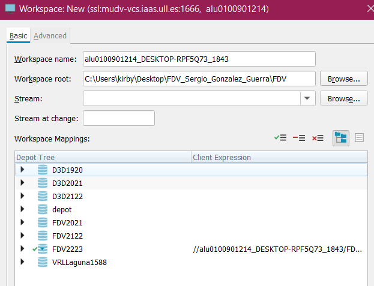
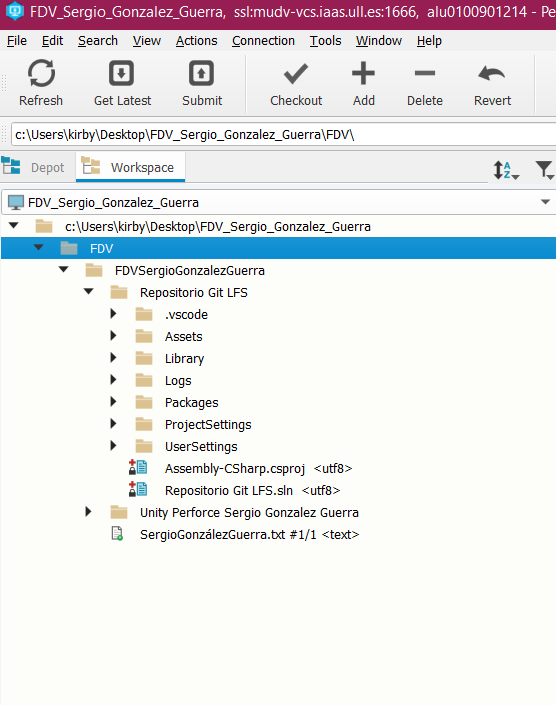
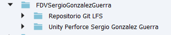

# Unity-Perforce

## Experimentando con el control de versiones con Perforce.

Tanto para añadir el proyecto de la tarea 1 como para añadir un nuevo proyecto de Unity 3D básico, he creado un nuevo workspace enlazando la ruta de una carpeta guardada en local al depot llamado "FDV2223".

Marcamos todos los ficheros enlazados a la carpeta con el botón "Add" y despues le hacemos un "Submit" para que se suban al depot.

Despues de subirlo, añado un fichero con mi nombre (SergioGonzálezGuerra.txt) a la carpeta enlazada en local y repetimos el proceso usando un "Add" y despues un "Submit" para que se suba a mi carpeta en el depot.

Resultado:

Para modificar el fichero de texto "presentacion.txt" debemos hacer un checkout sobre él y escribo mi experiencia en el desarrollo de videojuegos 2D y 3D.

